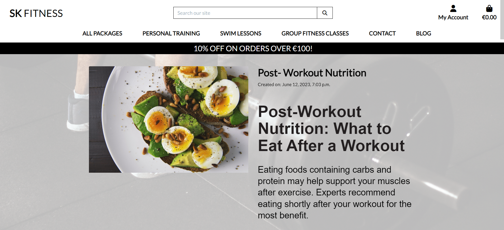
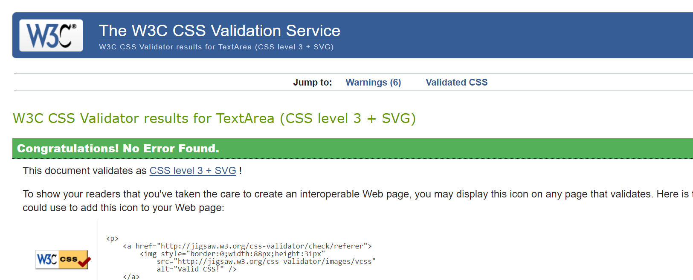

# SK Fitness
## Introduction

SK Fitness B2C e-commerce store that is  designed and implemented with Python and Django, HTML, CSS and some Javascript. It is an online portal to allow customers to ask questions, see what packages are available and educate themselves through our blog. .

Link to deployed site can be found [Here](https://sk-fitness.herokuapp.com/)

## Showcase

### Strategy
* Sk Fitness is a B2C type of business. Now a days, many of us are now opting for online shopping. Sk Fitness aims to offer flexible online shopping to its customers and to make enquiries.

# UX
## User stories
## As Admin
* As a admin I can manage users' accounts so that I can make any required changes to them if needed
* As a admin I can manage packages so that I can add , update or delete packages when necessary
* As a Admin I can delete any of comments so that I can remove them if I nolonger feel they are still necessary or needed
* As an admin I can manage the blog content so that I can make amendments if needed

## As a site user
* As a site user I can create or edit my account so that I can update my details accordingly
* As a site user I can login in my account so that I can view my order history
* As a site user I can search for packages so that I can find specific packages
* As a site user I can sort packages on criteria such as price and category so that I can I have a method of ordering the packages as I prefer
* As a site user I can browse through packages so that I can decide what I may be interested in buying
* As a site user I can look at package details so that I can decide if I want to purchase it
* As a site user I can easily add packages I want to purchase to a basket so that I can decide whether to purchase or not
* As a site user I can view the contents of my shopping basket so that I can be able to make any adjustments
* As a site user I can update my bag by adding more or remove packages so that I can decide on the number of packages I intend to buy
* As a site user I can view my order summary so that I can verify it before confirming
* As a site user I can checkout securely so that I can I maintain the level of trust on the site
* As a site user I can comment to the blog posts so that I can express my opinion to the post
* As a site user I can use the contact form so that I can contact the site owners
* As a site user I can sign up to newsletter so that I can keep updated on the latest news

## Architecture

## Database

  
Click here to view Database Schema:

  

## Design
Before I wrote any code for this site, I had to pin point a simple design of what I wanted my site to look like, to refer back to when needed.

  
Click here to view:

  
  

 
  

## Navigation
I wanted a simple and clean Nav bar so the user can easily find what the are looking for.

  
Click here to view the navigation:

  

## E-commerce type

Sk Fitness just to emphasisenis an online store that sells directly to customers. The functionality on this site for a regular customer is ability to make a purchase easy and quick. For the owners, the goal is to archieve CRUD functionality.
## Marketing
Though there are a lot of marketing techniques for businesses, Sk Fitness decided to first use the cheaper way. 

That is Social media, Creating content with our blog and facebook to drive out content and engage with customers. Visit our facebook page [here](https://www.facebook.com/SarahKeoPT/). 

Through SEO Keywords.

By enabling customers to sign up and subscribe for offers and blog posts through the newsletter.
 

# Features
## Homepage

To start off, clicking the Sk Fitness url takes you to the home page with a logo on the left, my account and shopping bag to the right, a search bar followed by a navigation menu and footer. All these appear on every page on the site. Also found on home page is  a hero image accompanied by a hero text, and a shop now button beneath it.
### Header and navigation

### The home page

### Register/Sign up
On the right side of the home page, for the first time user they will need to register their account to enjoy most of the site benefits such as saving their orders, commenting on blogs. When registering users are asked their username, email and password

### Sign in

Registered users would need to sign in when they visit the site again. They will be asked to enter their username and password. The Remember me option is also available making life easier for returning users. Is users need to reset their password, a forgot password is also available.

### Logout
Users are able to protecting their account by logging out of the site.

## All packages

The first navigation link from the logo is all packages. This is where you can display all packages available. On this a user has a liberty to sort the packages either by price or by category.

 ### Sort or search by category or price
 
 

 ### package detail and add to bag

 Each package on site has a detailed information in form of a name, price,image, description and its category. The user is displayed with a quantity input box to select the quantity they need to add to the shopping bag either increasing or decreasing. They have an option to go back to packages by clicking the keep shopping button.  Each time a user add a package to the bag they get a notification that alert them of that action.

 

 

 ### The shopping bag

 Consists of the price, quantity of each item and sub total. User has an option to update their bag and or remove some items from bag. They can easily go back to packages by clicking keep shopping or go to checkout.

### Checkout

On the left side of the checkout is where user puts their information, and on the right side is a summary of their order that is the total, the delivery.

User has an option to save their information to a profile. Users will need to input the card number for payment. They still have an option to adjust the bag at this point by clicking the adjust bag, or then completing the order.

After completing an order, users receive an order confirmation with their details including order number.

### Order confirmation email

After completing their order the customer get an email to confirm their purchase.

### Package detail- super user

If the user is the super user, they have an option to either delete or edit their package

### Package management- add package

Only super users are authorized to add packages to packages catalogue

### Package management- edit package

Super users only can edit the package by editing either name, description, category, price and update image. An alert is also available to remind them what action they are performing. They can then update the changes or cancel.

### package management- delete package

Super users only can as well delete the packages from the site

# Footer

The footer appears on all pages of the site, it contains the newsletter sign up, privacy policy, facebook.

## About us

About us page describes in bried what the site is all about to the users. With a shop now now beneath that takes users to the packages page

## Privacy policy

## Facebook

In terms of marketing, the site has a facebook page to push content.and target some of its customers through content creation

# Blog

Users can view all the blog articles and select which one to read by clicking the image

## Blog detail

Only logged in users are permitted to comment on articles in as much as they can read other comments written by other users

# Blog management

## Add blog

Super users are the creators of the blog articles. To add a new blog they have to put title, slug, body and image and then save

## Edit and delete blog

Super users can also edit the blog and update the changes or delete

# Contact us

A contact us page is available for users who need to get in touch with the store owners. They have to put their name, email and the overall message before sending.

# My Profile

The my profile page displays a user's saved contact infomation and their order history

# 404 page

A 404 page is also available to handle navigation errors with a home link button to take them back to the home page

### Future features

* Add a TDEE and BMI calculater
* Users replying to other blog comments
* Add nutrition packages

# Web marketing

## Email marketing

The free version of mailchimp was chosen with the current status of the business. Each user that signs up is added to the weekly newsletter and they might turn out to be future customers henceforth low cost to drive sales.

## Search engine optimization

SEO keywords

## Social media marketing

A facebook page was created to build community from the target market. Facebook is free and it also takes little to no time to set up and also it has so many users whom a business can strive to maintain a certain relationship, create content and connect with a target audience.

## Technologies
### Languages

* [HTML](https://developer.mozilla.org/en-US/docs/Web/HTML)

* [CSS](https://developer.mozilla.org/en-US/docs/Web/CSS)

* [Javascript](https://www.javascript.com/)

* [Python](https://www.python.org/)

### Frameworks, programs and libraries used

* [Django](https://www.djangoproject.com/) - Django is a high-level Python web framework that encourages rapid development and clean, pragmatic design.

* [Bootstrap4](https://getbootstrap.com/) - A css framework

* [Gitpod](https://www.gitpod.io/) - Gitpod was used as an IDE

* [Github](https://github.com/) - I used Github to store all the data of my project after pushing it

* [Heroku](https://www.heroku.com/) - is a cloud platform service  I used to deploy and host the project

* [ElephantSQL](https://www.elephantsql.com/) - used as a database for the project

* [Font Awesome](https://fontawesome.com/) - Was used to add icons for my social media links.

* [PEP8ci](https://pep8ci.herokuapp.com/) - I used it to validate python code

* [Stripe](https://stripe.com/en-ie) - was used for checkout functionality and facilitate online payments

* [AWS](https://aws.amazon.com/s3/) - for  object storage through a web service interface.

* [Pexels](https://www.pexels.com/) - images used for the project

# Testing
## Manual Testing
 | Feature | Test  | Expected Result | Actual Result |
| -------------| ----- | ----- | :----: |
| Sk Fitness  | Selecting logo on homepage |  directs user back to homepage |  Pass |
| Search | Using the search box | Entering a search returns expected result  |  Pass |
| Search no results | No search | Entering a no results search returns error message and shows all packages  |  Pass |
| Navigation Links  | Selecting navigation links |  directs user to relevant pages |  Pass |
| All packages  | Selecting all packages |  directs user to all packages |  Pass |
| Back to top | Back to top arrow | Select the arrow box on the packages page brings the user back to the top of the page  |  Pass |
| Sort By  | Selecting the filter Sort |  successfully sort by price, name and category options |  Pass |
| Buy Now button  | Selecting Shop Now button |  directs user to all  packages page |  Pass |
| Sign up for our newsletter | selecting Sign up for our newsletter |  directs user Sign up for our newsletter page |  Pass |
| Privacy policy | Selecting privacy policy |  directs user to privacy policy|  Pass |
| facebook icon | Selecting  facebook icon |  directs user to facebook page |  Pass |
| Blog | Selecting blog |  directs user to blog page |  Pass |
| Blog detail | Selecting Blog detail |  directs user to blog detail |  Pass |
| Leave a Comment when signed in | Submitting comment|  successfully submit and display comment |  Pass |
| Add blog | Adding a new blog | successfully add new blog to blog page  |  Pass |
| As Admin edit blog | editing blog|  successfully edited the blog |  Pass |
| As Admin Delete Comment | Deleting comment|  successfully remove comment |  Pass |
| Contact | Selecting Contact | directs user to contact page  |  Pass |
| Contact form submission | submitting contact form | successfully sends submit form and can seen be in admin |  Pass |
| My account | Selecting my account as admin | displays dropdown menu unique to admin apart from profile and logout  |  Pass |
| Add package | Adding a new package| successfully add new package to packages page  |  Pass |
| Add package | no image is selected | default image is used |  Pass |
| As Admin edit package | editing package |  successfully edited the package |  Pass |
| As Admin Delete package | Deleting package|  successfully remove package |  Pass |
| Register | Register for an account | selecting Register in my account directs user signup page |  Pass |
| Register | Registering as a new user | Registering as a new user form works |  Pass |
| Login | Login to an account | selecting Login in my account directs user to Login page |  Pass |
| Login | Login to an account | login-in as a new user form works |  Pass |
| Login as admin| Login to as admin gives access to blog/package management | login-in as a new user form works |  Pass |
| Logout | message shown | Logging out message shown |  Pass |

## User story testing
### Admin
* As a admin I can manage users' accounts so that I can make any required changes to them if needed
   > Admin can manage user accounts from admin panels
* As a admin I can manage packages so that I can add , update or delete packages when necessary
   > Admin can add, delete and update packages on the site
* As a admin I can view created orders so that I can full fill the orders or amend if needed
   > Admin can view orders in admin panel
* As a Admin I can delete any of comments so that I can remove them if I nolonger feel they are still necessary or needed
   > Only admin can delete comments 
* As a Admin I can view messages sent via contact form so that I can act upon them
   > Admin can view send messages in the admin panel
* As an admin I can manage the blog content so that I can make amendments if needed
   > Admin can add, edit or delete blogs via blog management. only accessible to admin

## User story testing
### User
* As a site user I can create or edit my account so that I can update my details accordingly
   > A user can create an account using register and update on my profile
* As a site user I can login in my account so that I can view my order history
   > Logged in user can view order history if they made a purchase before
* As a site user I can search for packages so that I can find specific packages
   > I made sure users can search for what they want using search bar
* As a site user I can sort packages on criteria such as price and category so that I can I have a method of ordering the packages
   > I made packages to be filtered by price or category for users to choose how they want to view
packages as I prefer
* As a site user I can browse through packages so that I can decide what I may be interested in buying
   > I made the site such that its easy to browse through all packages so they see what to order
* As a site user I can look at package details so that I can decide if I want to purchase it
   > Each package has a  detailed description so users understands more of it
* As a site user I can easily add packages I want to purchase to a basket so that I can decide whether to purchase or not
   > Users can easily add packages to bag
* As a site user I can view the contents of my shopping basket so that I can be able to make any adjustments
   > User can view bag contents by clicking the bag itself
* As a site user I can update my bag by adding more or remove packages so that I can decide on the number of packages I intend to buy
   > User can update the bag to a quantity they want or remove everything entirely
* As a site user I can view my order summary so that I can verify it before confirming
   > From secure checkout, users can verify their order summary before buying
* As a site user I can checkout securely so that I can I maintain the level of trust on the site
   > I made sure users have secure checkout when completeing a purchase
* As a site user I can view paginated posts so that I can select which posts to view
   > Blog posts are paginated, clear and easy to see so to select which to view
* As a site user I can view all posts so that I can decide what I may be interested in reading
   > Users can easily choose which one to read
* As a site user I can comment to the blog posts so that I can express my opinion to the post
   > I made the site such that signed in user can comment on blog posts
* As a site user I can use the contact form so that I can contact the site owners
  > By using the contact form, user can send messages to the site owners
* As a site user I can sign up to newsletter so that I can keep updated on the latest news
  > By going to sign up newsletter on the footer, users can easily sign up to receive latest news.

## Functionality testing

Throughout developing this site, I have been using Chrome, and chrome dev tools to help with debugging issues. Testing responsiveness was done using chrome emulated devices.

## Compatibility testing

Chrome emulated devices, and hardware devices iphone , samsung  and samsung tablet were used to test compatibility

## Wave testing

I also tested this site on [WAVE Web Accessibility Evaluation Tool](https://wave.webaim.org/) is a set of evaluation tools which helps authors to make their web content more accessible to individuals with disabilities. WAVE can identify many accessibility and Web Content Accessibility Guideline (WCAG) errors, but also facilitates human evaluation of web content as per definition on their site.

  
Click here for Lighthouse results

 Desktop

  
 
  
 

  

  
Click here for Markup results

   

  
 

  

  
Click here for CSS results 

  

  
 

### Javascript validation
I used JSlint to validate javascript

### Python
[ CI Python linter ](https://pep8ci.herokuapp.com/) was used to test python code

  
Click here for CSS results 

  

  
 

## Bugs

For this project there were so many bugs I encountered from the beginning though some were minor. Some of them I ended up taking them to tutor support whom have been very helpful.

### Bug 1
I had edited my profile models and once i had migrated the i was getting an OSError caused by the email being conflicted, oncei  logged on to admin and removed duplicate email addresses it resolved itself.

### Bug 2

I had many small errors - missing curly braces, typo's and even the > instead of <!
 
### Bug 3

I had errors in validating html and to resolve them I had to put ul tags in mobile header.

# Deployment

I developed this site on Gitpod, using git for version control. Then deployed to Heroku using the following steps

* Log in to [Heroku](https://id.heroku.com/login) or create an account

* Click New and Create New App

* I selected Europe as region.

* Click Create App button

I then went to create a database to connect to the new created app.

* Login to [ElephantSQL](https://www.elephantsql.com/)

* Create new instance

* Set up your plan - Give the plan a name and select Tiny Turtle free plan

* Select region button

* Select a data center ner your. I selected EU-West-1(Ireland)

* Click Review

* Click Create instance

* Return to elephantsql dashboard, click on database instance name

* In the url section, clicking the copy icon will copy the database url to the clipboard

* Go back to Heroku to your created app, go to Settings

* Add config var DATABASE-URL, and for the value, copy in your databse url from ElephantSQL. do not add quotation marks around your database

* In Gitpod install dj-database_url and psycopg2 to connect to your external database

* Update requirements.txt: pip freeze > requirements

* import dj_database_url in settings and update your database

* migrate your database

* create a new superuser for your database and at this point your database is exposed do not commit it to github

* Install gunicorn and freeze into the requirements file

* Then create Procfile

* DISABLE_COLLECTSTATIC

* Commit and push to github

* On your app in Heroku go to Deploy and connect it to github and search your repository, click connect.

* Choose automatic or manual deploy. I chose manual. Click deploy branch

* When complete click View to open the deployed app

## From Github docs

### Forking 

* Open GitHub page that hosts the repository you wish to fork.
* Find the 'Fork' button at the top right of the page
* Once you click the button the fork will be in your repository

### Cloning

* Open Go to the repository page on Github
* click on the green button that says "Code".
* You can choose to download a zip file of the repository, unpack it on your local machine, and open it in your IDE.
* Copy the URL under the HTTPS tab to clone using https.
* In a new window, and set the current directory to the one you want to contain the clone from.
* Type git clone and paste the URL copied from the GitHub page.
* The repository clone will now be created on your machine. 

## Credits

* Images are from [Pexels](https://www.pexels.com/)

* Code Institute Botique Ado walk through

* Hello django code institute

* [Youtube](https://youtube.com)

* [Stack overflow](https://stackoverflow.com/)

#### Blog content

A couple of random articles on the first page of google.
Images are from [Pexels](https://www.pexels.com/)

### Acknowledgement and support

* This whole course was challenging, yet enjoyable. I haev learn so much and look forward to my furture learning with a good foundation. A big thank you to Code institute and their amazing team.  

* Slack channel is a truely invaluble source of knowledge!

* My Mentor, for his honest feedback.

* My family and friends for putting up with me when i was stress!